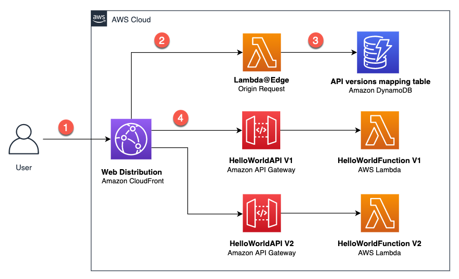
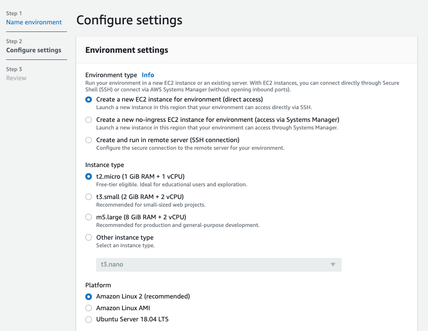
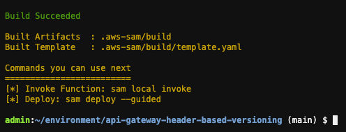
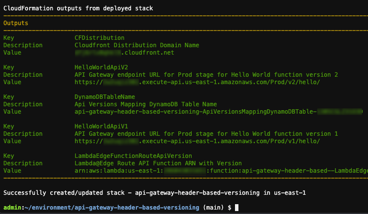
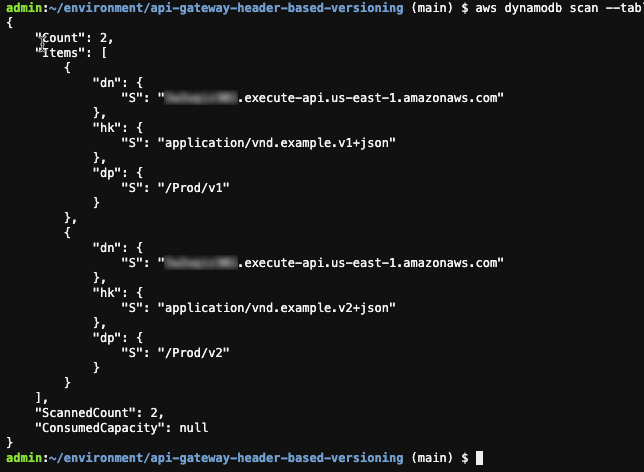
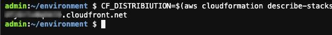
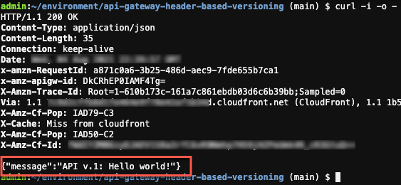
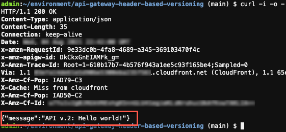
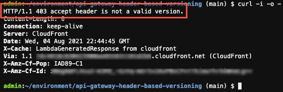

## Implementing header-based API Gateway versioning with Amazon CloudFront

In this blog post, I show you how to use [Lambda@Edge](https://aws.amazon.com/lambda/edge/) feature of [Amazon CloudFront](https://aws.amazon.com/cloudfront/) to implement a header-based API versioning solution for [Amazon API Gateway](https://aws.amazon.com/api-gateway/). 

[Amazon API Gateway](https://aws.amazon.com/api-gateway/) is a fully managed service that makes it easier for developers to create, publish, maintain, monitor, and secure APIs at any scale. [Amazon CloudFront](https://aws.amazon.com/cloudfront/) is a global content delivery network (CDN) service built for high-speed, low-latency performance, security, and developer ease-of-use. [Lambda@Edge](https://aws.amazon.com/lambda/edge/) is a feature of [Amazon CloudFront](https://aws.amazon.com/cloudfront/), a compute service that lets you run functions that customize the content that CloudFront delivers.

The example uses the [AWS SAM CLI](https://docs.aws.amazon.com/serverless-application-model/latest/developerguide/what-is-sam.html) to build, deploy, and test the solution on AWS. The [AWS Serverless Application Model (AWS SAM)](https://aws.amazon.com/serverless/sam/) is an open-source framework that you can use to build [serverless applications](https://aws.amazon.com/serverless/) on AWS. The AWS SAM CLI lets you locally build, test, and debug your applications defined by AWS SAM templates. You can also use the AWS SAM CLI to deploy your applications to AWS, or create secure continuous integration and deployment (CI/CD) pipelines.

After an API becomes publicly available, it is used by customers. As a service evolves, its contract also evolves to reflect new changes and capabilities. It’s safe to evolve a public API by adding new features but it's not safe to change or remove existing features. 
Any breaking changes may impact consumer’s applications and break them at runtime. API versioning is important to avoid breaking backward compatibility and breaking a contract. You need a clear strategy for API versioning to help consumers adopt them.

### Versioning APIs 
Two of the most commonly used API versioning strategies are URI versioning and header-based versioning.

#### URI versioning

This strategy is the most straight forward and the most commonly used approach. In this type of versioning, versions are explicitly defined as part of API URIs. These example URLs show how domain name, path, or query string parameters can be used to specify a version:

```
https://api.example.com/v1/myservice
https://apiv1.example.com/myservice
https://api.example.com/myservice?v=1
```
To deploy an API in [API Gateway](https://aws.amazon.com/api-gateway/), the deployment must be associate with a stage. A stage is a logical reference to a lifecycle state of your API (for example, dev, prod, beta, v2). As your API evolves, you can continue to [deploy it to different stages](https://docs.aws.amazon.com/apigateway/latest/developerguide/how-to-deploy-api.html) as different versions of the API.

#### Header-based versioning

This strategy is another commonly used versioning approach. It uses HTTP headers to specify the desired version. It uses the `Accept` header for content negotiation or uses a custom header (for example, `APIVER` to indicate a version):

```
Accept:application/vnd.example.v1+json
APIVER:v1
```

This approach allows you to preserve URIs between versions. As a result, you have a cleaner and more understandable set of URLs. It is also easier to add versioning after design. However, you may need to deal with complexity of returning different versions of your resources.

---------------
### Index
---------------

* [Architecture](#architecture)
* [Setting up the development environment](#setting-up-the-development-environment)
* [Deploying the solution](#deploying-the-solution)
  * [Download the sample serverless application](#download-the-sample-serverless-application)
  * [Build your application](#build-your-application)
  * [Deploy your application](#deploy-your-application)
* [Testing the solution](#testing-the-solution)
* [Mitigating latency](#mitigating-latency)
* [Cleaning up](#cleaning-up)
* [Security](#security)
* [License](#license)
---------------
### Architecture
---------------

The target architecture for the solution uses [Lambda@Edge](https://aws.amazon.com/lambda/edge/). It dynamically routes a request to the relevant API version, based on the provided header:

<p align="center">
  
</p>

In this architecture:

1.	The user sends a request with a relevant header, which can be either *“Accept”* or another custom header.
2.	This request reaches the CloudFront distribution and triggers the *Lambda@Edge Origin Request*.
3.	The *Lambda@Edge* function uses provided header value and fetches data from an [Amazon DynamoDB](https://aws.amazon.com/dynamodb/) table. This table contains mappings for API versions. The function then modifies the Origin and the Host header of the request and returns it back to CloudFront.
4.	CloudFront sends the request to the relevant Amazon API Gateway URL.

In the next sections, I walk you through setting up the development environment and deploying and testing this solution.

---------------
### Setting up the development environment
---------------

To deploy this solution on AWS, you use the [AWS Cloud9 development environment](https://aws.amazon.com/cloud9/).

1.	Go to the [AWS Cloud9 web console](https://console.aws.amazon.com/cloud9/home?region=us-east-1). In the Region dropdown, make sure you’re using **N. Virginia (us-east-1)** Region.
2.	Select **Create environment**. 
3.	On Step 1 - **Name environment**, enter a name for the environment, and choose **Next step**.
4.	On Step 2 - **Configure settings**, keep the existing environment settings.

<p align="center">
  
</p>

5.	Choose **Next step**. Choose **Create environment**.

---------------
### Deploying the solution
---------------

Now that the development environment is ready, you can proceed with the solution deployment. In this section, you download, build, and deploy a sample serverless application for the solution using AWS SAM.

#### Download the sample serverless application

The solution sample code is available on GitHub. Clone the repository and download the sample source code to your Cloud9 IDE environment by running the following command in the Cloud9 terminal window:

```bash
git clone https://github.com/aws-samples/amazon-api-gateway-header-based-versioning.git ./api-gateway-header-based-versioning
```

This sample includes:

* `template.yaml`: Contains the AWS SAM template that defines your application's AWS resources.
* `hello-world/`: Contains the Lambda handler logic behind the API Gateway endpoints to return hello world message.
* `edge-origin-request/`: Contains the Lambda@Edge handler logic to query the API version mapping and modify the *Origin* and the *Host* header of the request.
* `init-db/`: Contains the Lambda handler logic for a [custom resource](https://docs.aws.amazon.com/AWSCloudFormation/latest/UserGuide/template-custom-resources.html) to populate sample DynamoDB table.

#### Build your application

Run the following commands in order to first, change into the project directory, where the template.yaml file for the sample application is located then build your application:

```bash
cd ~/environment/api-gateway-header-based-versioning/
sam build
```

Output:
<p align="center">
  
</p>

#### Deploy your application

Run the following command in order to deploy your application in guided mode for the first time:

```bash
sam deploy --guided
```

Follow the on-screen prompts. Respond with Enter To accept the default options provided in the interactive experience. Respond to the interactive questions as follows:

* `Stack Name [sam-app]:` choose a stack name i.e. *“api-gateway-header-based-versioning”*
* `AWS Region [us-east-1]:` press *Enter* to accept the default value *“us-east-1”* Region 
* `Parameter ApiVersionHeaderName [Accept]:` press Enter to accept the default value “*Accept*” header
* `Parameter SampleApiVersionMappingV1 [application/vnd.example.v1+json]:` press *Enter* to accept the default value
* `Parameter SampleApiVersionMappingV2 [application/vnd.example.v2+json]:` Press *Enter* to accept the default value
* `Confirm changes before deploy [y/N]:` N
* `Allow SAM CLI IAM role creation [Y/n]:` Y
* `HelloWorldFunctionV1 may not have authorization defined, Is this okay? [y/N]:` y
* `HelloWorldFunctionV2 may not have authorization defined, Is this okay? [y/N]:` y
* `Save arguments to configuration file [Y/n]:` Y
* `SAM configuration file [samconfig.toml]:` press *Enter* to accept the default value
* `SAM configuration environment [default]:` press *Enter* to accept the default value

Output:
<p align="center">
  
</p>

In the output of the `sam deploy` command, you can see the changes being made to your [AWS CloudFormation stack](https://console.aws.amazon.com/cloudformation/home?region=us-east-1).

---------------
### Testing the solution
---------------

This application implements all required components for the solution. It consists of two Amazon API Gateway endpoints backed by AWS Lambda functions. The deployment process also initializes the API Version Mapping DynamoDB table with the values provided earlier in the deployment process.

Run the following commands to see the created mappings:

```bash
STACK_NAME=$(grep stack_name ~/environment/api-gateway-header-based-versioning/samconfig.toml | awk -F\= '{gsub(/"/, "", $2); gsub(/ /, "", $2); print $2}')
DDB_TBL_NAME=$(aws cloudformation describe-stacks --region us-east-1 --stack-name $STACK_NAME --query 'Stacks[0].Outputs[?OutputKey==`DynamoDBTableName`].OutputValue' --output text) && echo $DDB_TBL_NAME
aws dynamodb scan --table-name $DDB_TBL_NAME
```

Output:
<p align="center">
  
</p>

When a user sends a GET request to CloudFront, it routes the request to the relevant API Gateway endpoint version according to the provided header value. The Lambda function behind that API Gateway endpoint is invoked and returns a “hello world” message. 
To send a request to the CloudFront distribution, which is created as part of the deployment process, first get its domain name from the deployed [AWS CloudFormation stack](https://console.aws.amazon.com/cloudformation/home?region=us-east-1):

```bash
CF_DISTRIBUTION=$(aws cloudformation describe-stacks --region us-east-1 --stack-name $STACK_NAME --query 'Stacks[0].Outputs[?OutputKey==`CFDistribution`].OutputValue' --output text) && echo $CF_DISTRIBUTION
```

Output:
<p align="center">
  
</p>

You can now send a GET request along with the relevant header you specified during the deployment process to the CloudFront to test the application.

Run the following command to test the application for API version one. Note that if you entered a different value other than the default value provided during the deployment process, change the --header parameter to match your inputs:

```bash
curl -i -o - --silent -X GET "https://${CF_DISTRIBUTION}/hello" --header "Accept:application/vnd.example.v1+json" && echo
```

Output:
<p align="center">
  
</p>

The response shows that CloudFront successfully routed the request to the API Gateway v1 endpoint as defined in the mapping Amazon DynamoDB table. API Gateway v1 endpoint received the request. The Lambda function behind the API Gateway v1 was invoked and returned a “hello world” message.

Now you can change the header value to v2 and run the command again this time to test the API version two:

```bash
curl -i -o - --silent -X GET "https://${CF_DISTRIBUTION}/hello" --header "Accept:application/vnd.example.v2+json" && echo
```

Output:
<p align="center">
  
</p>

The response shows that CloudFront routed the request to the API Gateway v2 endpoint as defined in the mapping DynamoDB table. API Gateway v2 endpoint received the request. The Lambda function behind the API Gateway v2 was invoked and returned a “hello world” message.

This solution requires valid header value on each individual request, so the application checks and raises an error if the header is missing or the header value is not valid. 

You can remove the header parameter and run the command to test this scenario:

```bash
curl -i -o - --silent -X GET "https://${CF_DISTRIBUTION}/hello" && echo
```

Output:
<p align="center">
  
</p>

The response shows that Lambda@Edge validated the request and raised an error to inform us that the request did not have a valid header.

---------------
### Mitigating latency
---------------

In this solution, Lambda@Edge reads the API version mappings data from the DynamoDB table. Accessing external data at the edge can cause additional latency to the request. In order to mitigate the latency, solution uses following methods:

1.	Cache data in Lambda@Edge memory: As data is unlikely to change across many Lambda@Edge invocations, Lambda@Edge caches API version mappings data in the memory for a certain period of time. It reduces latency by avoiding an external network call for each individual request.
2.	Use [Amazon DynamoDB global table](https://aws.amazon.com/dynamodb/global-tables/): It brings data closer to the CloudFront distribution and reduces external network call latency.

---------------
### Cleaning up
---------------

To clean up the resources provisioned as part of the solution:

1.	Go to the [AWS CloudFormation console](https://console.aws.amazon.com/cloudformation/home?region=us-east-1). Choose the “api-gateway-header-based-versioning” stack then choose Delete. 
2.	Go to the [Cloud9 web console](https://console.aws.amazon.com/cloud9/home?region=us-east-1). Select the environment you created then select "Delete" button.

---------------
### Conclusion
---------------

Header-based API versioning is a commonly used versioning strategy. This post shows how to use CloudFront to implement a header-based API versioning solution for API Gateway. It uses the AWS SAM CLI to build and deploy a sample serverless application to test the solution in the AWS Cloud.

To learn more about API Gateway, visit the [API Gateway developer guide documentation](https://docs.aws.amazon.com/apigateway/latest/developerguide), and for CloudFront, refer to [Amazon CloudFront developer guide documentation](https://docs.aws.amazon.com/AmazonCloudFront/latest/DeveloperGuide).

## Security

See [CONTRIBUTING](CONTRIBUTING.md#security-issue-notifications) for more information.

## License

This library is licensed under the MIT-0 License. See the LICENSE file.
