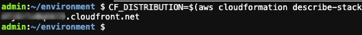

## Implementing header based API Gateway versioning with Amazon CloudFront

After an API becomes publicly available, it starts being used by customers. As a service evolves its contract would also evolve to reflect the new changes and capabilities. It’s safe to evolve a public API by adding new features but it's not safe to change or remove existing features. 

Any non-backward compatible contract change may impact consumer’s applications and break them at runtime. API versioning is important to avoid breaking backward compatibility and violating a contract. Therefore, it is needed to specify a clear strategy on how to version our APIs and help consumers adopt them.

There are few ways that you can version an API. Here is the most commonly used API versioning strategies:

#### URI versioning

This strategy is the most straight forward and the most commonly used approach. In this type of versioning, version should be explicitly defined as part of API URIs. The example URLs below show how domain name, path or query string parameters can be used to specify a version.

```
https://api.example.com/v1/myservice
https://apiv1.example.com/myservice
https://api.example.com/myservice?v=1
```

In order to deploy an API in [Amazon API Gateway](https://aws.amazon.com/api-gateway/),  the deployment needs to be associate with a stage. A stage is a logical reference to a lifecycle state of your API (for example, dev, prod, beta, v2). As your API evolves, you can continue to [deploy it to different stages](https://docs.aws.amazon.com/apigateway/latest/developerguide/how-to-deploy-api.html) as different versions of the API. 

#### Header based versioning

This strategy is another commonly used versioning approach. It uses HTTP headers to specify the desired version. It can use `Accept` header for content negotiation or use a custom header i.e. `APIVER` to indicate a version. For example:

```
Accept:application/vnd.example.v1+json
APIVER:v1
```

This approach allows you to preserve your URIs between versions. As result you have a cleaner and more understandable set of URLs. It is also easier to add versioning after design. However you may need to deal with complexity of returning different versions of your resources.

In this blog post, we show you how to use [Amazon CloudFront](https://aws.amazon.com/cloudfront/) to implement a header based API versioning solution for [Amazon API Gateway](https://aws.amazon.com/api-gateway/).

In addition, we take advantage of [AWS SAM CLI](https://docs.aws.amazon.com/serverless-application-model/latest/developerguide/what-is-sam.html) to build, deploy, and test our solution on AWS. The [AWS Serverless Application Model (AWS SAM)](https://aws.amazon.com/serverless/sam/) is an open-source framework that you can use to build [serverless applications](https://aws.amazon.com/serverless/) on AWS.

---------------
### Index
---------------

* [Architecture](#architecture)
* [Setup the development environment](#setup-the-development-environment)
* [Deploy the solution](#deploy-the-solution)
  * [Download the sample serverless application](#download-the-sample-serverless-application)
  * [Build your application](#build-your-application)
  * [Deploy your application](#deploy-your-application)
* [Test the solution](#test-the-solution)
* [Mitigate the latency](#mitigate-the-latency)
* [Clean up](#clean-up)
* [Contributing](#contributing)
* [Security](#security)
* [License Summary](#license-summary)
---------------
### Architecture
---------------

Our target architecture for our solution uses [Lambda@Edge](https://aws.amazon.com/lambda/edge/) to dynamically route a request to the relevant API version based on the provided header as shown in the following diagram. 

Lambda@Edge is a feature of [Amazon CloudFront](https://aws.amazon.com/cloudfront/) that lets you run code closer to users of your application, which improves performance and reduces latency.

<p align="center">
  
</p>

In this architecture:

1.	User sends a request with relevant header which can be either *“Accept”* or another custom header
2.  This request gets to the Amazon CloudFront distribution and triggers the *Lambda@Edge Origin Request*
3.  The *Lambda@Edge* function uses provided header value and fetches data from an [Amazon DynamoDB](https://aws.amazon.com/dynamodb/) table. This table contains mappings for API versions. The function then modifies the *Origin* and the *Host* header of the request and returns it back to Amazon CloudFront
4.  Amazon CloudFront sends the request to the relevant Amazon API Gateway URL.

In the next sections, we walk you through setting up the development environment and deploying and testing this solution.

---------------
### Setup the development environment
---------------

To deploy this solution on AWS, we use the AWS [Cloud9 development environment](https://aws.amazon.com/cloud9/).

1.  Go to the [Cloud9 web console](https://console.aws.amazon.com/cloud9/home?region=us-east-1)
2.  At the top right corner of the console, make sure you’re using *N. Virginia (us-east-1)* region **
3.  Select *Create environment*
4.  On Step 1 - *Name environment*, enter a name for the environment, and go to the *Next step*
5.  On Step 2 - *Configure settings*, Leave all of the environment settings as they are:
    * *Environment type:* Create a new EC2 instance for the environment (direct access)
    * *Instance type:* t2.micro (1 Gib RAM + 1 vCPU)
    * *Platform:* Amazon Linux 2 (recommended)

<p align="center">
  
</p>

6.  Go to the *Next step*
7.  Click *Create environment*

When the environment is ready, customize the layout as below

1.  Close the all *tabs* 
2.  Close the *lower work area*
3.  Open a *New Terminal* tab in the main work area

<p align="center">
  
</p>

---------------
### Deploy the solution
---------------

Now that the development environment is ready, we can proceed with the solution deployment. In this section, we download, build, and deploy a sample serverless application for our solution using AWS SAM.

#### Download the sample serverless application

The solution sample code is available on GitHub. Clone the repository and download the sample source code to your Cloud9 IDE environment by running the following command in the Cloud9 terminal window:

```bash
git clone https://github.com/aws-samples/amazon-api-gateway-header-based-versioning.git ./api-gateway-header-based-versioning
```

This sample includes:

* `template.yaml`: Contains the AWS SAM template that defines your application's AWS resources
* `hello-world/`: Contains the Lambda handler logic behind the API Gateway endpoints to return hello world message
* `edge-origin-request/`: Contains the Lambda@Edge handler logic to query the API version mapping and modify the *Origin* and the *Host* header of the request.
* `init-db/`: Contains the Lambda handler logic for a [custom resource](https://docs.aws.amazon.com/AWSCloudFormation/latest/UserGuide/template-custom-resources.html) to populate sample Amazon DynamoDB table 


#### Build your application

The `sam build` command builds your AWS SAM application and prepares it for subsequent steps in the workflow. This command processes your AWS SAM template file, application code, and any applicable language-specific files and dependencies.

Run following commands in order to first, change into the project directory, where the `template.yaml` file for the sample application is located then build your application:

```bash
cd ~/environment/api-gateway-header-based-versioning/
sam build
```

Output:
<p align="center">
  
</p>

#### Deploy your application

The `sam deploy` command deploys your AWS SAM application to the AWS Cloud using AWS CloudFormation. Run following commands in order to deploy your application in guided mode for the first time:

```bash
sam deploy --guided
```

Follow the on-screen prompts. Respond with *Enter* To accept the default options provided in the interactive experience. Please respond to the interactive questions as below:

* `Stack Name [sam-app]:` choose a stack name i.e. *“api-gateway-header-based-versioning”*
* `AWS Region [us-east-1]:` press *Enter* to accept the default value *“us-east-1”* region 
* `Parameter ApiVersionHeaderName [Accept]:` press Enter to accept the default value “*Accept*” header
* `Parameter SampleApiVersionMappingV1 [application/vnd.example.v1+json]:` press *Enter* to accept the default value
* `Parameter SampleApiVersionMappingV2 [application/vnd.example.v2+json]:` Press *Enter* to accept the default value
* `Confirm changes before deploy [y/N]:` N
* `Allow SAM CLI IAM role creation [Y/n]:` Y
* `HelloWorldFunctionV1 may not have authorization defined, Is this okay? [y/N]:` y
* `HelloWorldFunctionV2 may not have authorization defined, Is this okay? [y/N]:` y
* `Save arguments to configuration file [Y/n]:` Y
* `SAM configuration file [samconfig.toml]:` press *Enter* to accept the default value
* `SAM configuration environment [default]:` press *Enter* to accept the default value

Output:
<p align="center">
  
</p>

In the output of the `sam deploy` command, you can see the changes being made to your [AWS CloudFormation stack](https://console.aws.amazon.com/cloudformation/home?region=us-east-1).

---------------
### Test the solution
---------------

This application implements all required components for our solution. it consists of two basic Amazon API Gateway endpoints backed by AWS Lambda functions. The deployment process also initializes the API Version Mapping DynamoDB table with the values provided earlier in the deployment process. 

Run following commands to see the created mappings:

```bash
STACK_NAME=$(grep stack_name ~/environment/api-gateway-header-based-versioning/samconfig.toml | awk -F\= '{gsub(/"/, "", $2); gsub(/ /, "", $2); print $2}')
DDB_TBL_NAME=$(aws cloudformation describe-stacks --region us-east-1 --stack-name $STACK_NAME --query 'Stacks[0].Outputs[?OutputKey==`DynamoDBTableName`].OutputValue' --output text) && echo $DDB_TBL_NAME
aws dynamodb scan --table-name $DDB_TBL_NAME
```

Output:
<p align="center">
  
</p>

In this sample application when user sends a GET request to the Amazon CloudFront it routes the request to the relevant API Gateway endpoint version according to the provided header value. Then the Lambda function behind that API Gateway endpoint is invoked and returns a hello word message. 

In order to send a request to the Amazon CloudFront distribution which is created as part of the deployment process, we should first run following commands to get it’s domain name from the deployed [AWS CloudFormation stack](https://console.aws.amazon.com/cloudformation/home?region=us-east-1).

```bash
CF_DISTRIBIUTION=$(aws cloudformation describe-stacks --region us-east-1 --stack-name $STACK_NAME --query 'Stacks[0].Outputs[?OutputKey==`CFDistribution`].OutputValue' --output text) && echo $CF_DISTRIBIUTION
```

Output:
<p align="center">
  
</p>

We can now send a GET request along with the relevant header we specified during the deployment process to the Amazon CloudFront to test our application.

Run following commands to test our application for API version 1. Please note that if you entered a different value other than the the default value provided during the deployment process you should change the --header parameter to match your inputs.

```bash
curl -i -o - --silent -X GET "https://${CF_DISTRIBIUTION}/hello" --header "Accept:application/vnd.example.v1+json" && echo
```

Output:
<p align="center">
  
</p>

Response shows that CloudFront successfully routed the request to the API Gateway v1 endpoint as defined in our mapping Amazon DynamoDB table. API Gateway v1 endpoint received the request. So as result the Lambda function behind the API Gateway v1 was invoked and returned a hello world message.

Now we can change the header value to v2 and run the commands again this time to test our API version 2:

```bash
curl -i -o - --silent -X GET "https://${CF_DISTRIBIUTION}/hello" --header "Accept:application/vnd.example.v2+json" && echo
```

Output:
<p align="center">
  
</p>

Response shows that CloudFront this time routed the request to the API Gateway v2 endpoint as defined in our mapping Amazon DynamoDB table. API Gateway v2 endpoint received the request. So as result the Lambda function behind the API Gateway v2 was invoked and returned a hello world message.

This solution requires valid header value on each individual request, so the application checks and raises an error if the header is missing or the header value is not valid. 

We can remove the header parameter and run the commands to test this scenario:

```bash
curl -i -o - --silent -X GET "https://${CF_DISTRIBIUTION}/hello" && echo
```

Output:
<p align="center">
  
</p>

Response shows that Lambda@Edge validated the request and raised an error to inform us that our request did not have a valid header.

---------------
### Mitigate the latency
---------------

In this solution Lambda@Edge requires to read API version mappings data from the DynamoDB table. Accessing external data at the edge can cause additional latency to the request. In order to mitigate the latency, solution uses following methods:

1.  Cache data in Lambda@Edge Memory: As our data is very unlikely to change across many Lambda@Edge invocations, Lambda@Edge caches API versions mapping data in the memory for a certain period of time. It reduces latency by avoiding an external network call for each individual request.
2.  Use [Amazon DynamoDB global table](https://aws.amazon.com/dynamodb/global-tables/): It brings data closer to the Amazon CloudFront distribution and Lambda@Edge and reduces external network call latency.

---------------
### Clean up
---------------

To cleanup the resources provisioned as part of the solution, you will need to carry out the following steps:

1.  Go to the [AWS CloudFormation console](https://console.aws.amazon.com/cloudformation/home?region=us-east-1).
2.  Click the “api-gateway-header-based-versioning” stack then select "Delete" button. Your stack will take some time to be deleted. You can track its progress in the "Events" tab. Once it is done, the status will change from "DELETE_IN_PROGRESS" to "DELETE_COMPLETE". It will then disappear from the list.
3.  Go to the [Cloud9 web console](https://console.aws.amazon.com/cloud9/home?region=us-east-1).
4.  Select the environment you created then select "Delete" button.

---------------
### Conclusion
---------------

Header based API versioning is one of the commonly used versioning strategy. This post showed how to use Amazon CloudFront to implement a header based API versioning solution for Amazon API Gateway. We also used AWS SAM CLI to build and deploy a sample serverless application to test our solution on AWS.

To learn more about Amazon API Gateway, visit the [API Gateway developer guide documentation](https://docs.aws.amazon.com/apigateway/latest/developerguide), and for Amazon CloudFront refer to [Amazon CloudFront developer guide documentation](https://docs.aws.amazon.com/AmazonCloudFront/latest/DeveloperGuide).


## Security

See [CONTRIBUTING](CONTRIBUTING.md#security-issue-notifications) for more information.

## License

This library is licensed under the MIT-0 License. See the LICENSE file.
